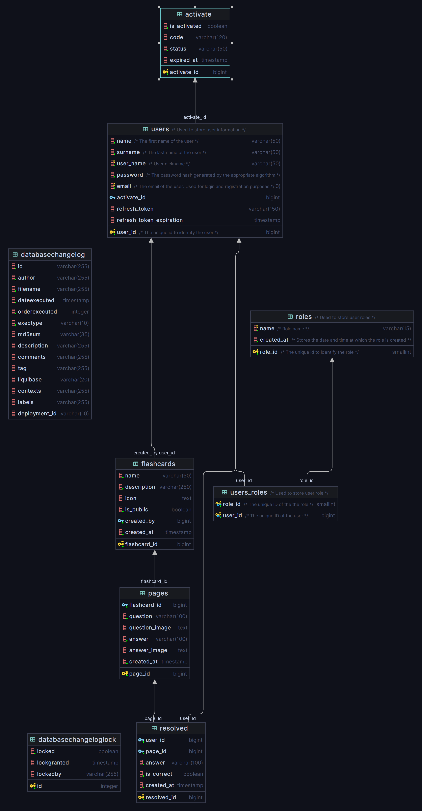

# Flashcards

A simple web application written in Angular and Java

## Overview

Flashcards is an application for creating and solving flashcards. It has a responsive user interface and a connection to a PostgreSQL database and RabbitMQ.

## Technologies

* Angular
* Java
* WebFlux
* RabbitMQ
* PostgreSQL
* Liquibase
* Docker

## Services
* mail

    It's a service written in Java and Spring Framework. It listens for messages sent by the service to the queue and sends an activation email if the user has registered correctly.
* db

    This is the service where changelogs for the Liquibase tool are stored.
* service

    This is the main application written in Java and Spring Framework. It uses the Spring Webflux reactive programming library.
* auth

    This is a service that deals with user authorization and registration, after correct registration sends a message to the queue to send an email through the mail service

## Getting Started

1. Run PostgreSQL and RabbitMQ by `docker-compose up` command in docker directory
2. Run db by `gradle :db:update`
3. Run gateway by `gradle :gateway:bootRun`
4. Run auth by `gradle :auth:bootRun`
5. Run service by `gradle :service:bootRun`
6. Run mail by `gradle :mail:bootRun`
7. Run Angular client by `ng serve` in client dir
8. Go to `localhost:4200/`

## Database

The project uses a PostgreSQL database, which is managed by Liquibase. Liquibase is used to manage database migrations and write code in multiple formats, which is then converted to SQL. In this project, I use XML notation.

Entity Relationship Diagram (ERD)

